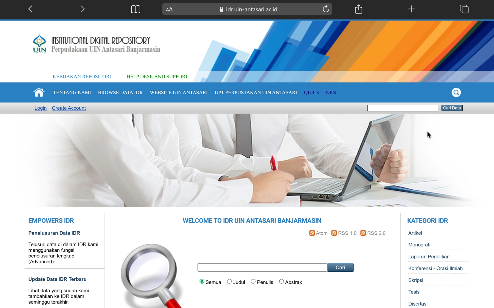
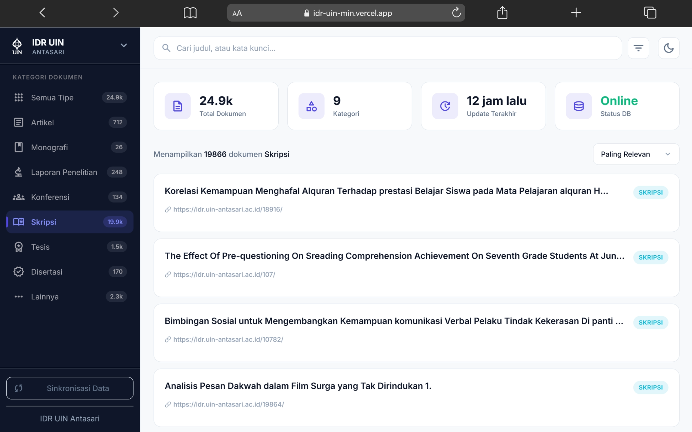
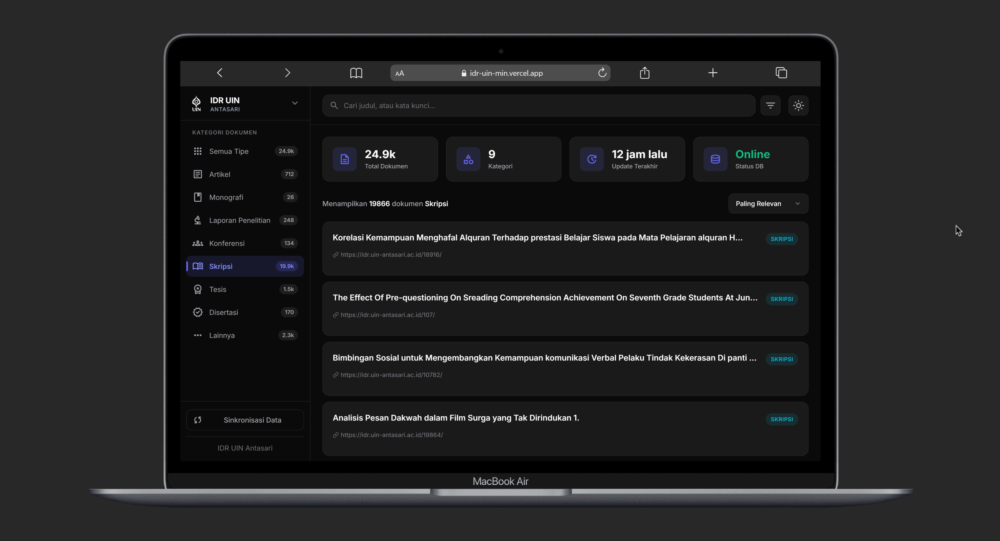
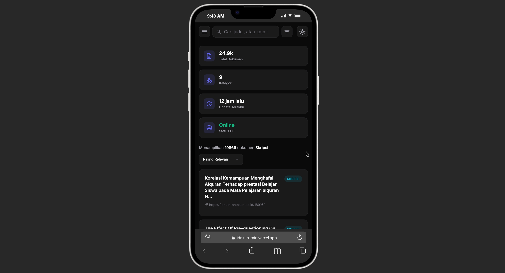

# Search Engine - IDR UIN Antasari

Mesin pencari sederhana untuk situs idr.uin-antasari.ac.id

[](https://idr-uin-min.vercel.app/)

## Tampilan Antarmuka (Screenshots)

### Perbandingan dengan Web Asli

Berikut adalah perbandingan antara antarmuka bawaan (resmi) dari E-Prints IDR UIN Antasari dengan antarmuka modern (tema terang) yang ditawarkan oleh mesin pencari alternatif ini:

|             Tampilan Web Resmi              |            Tampilan IDR UIN Min            |
| :-----------------------------------------: | :----------------------------------------: |
|  |  |

### Responsivitas (Desktop vs Mobile)

Aplikasi ini dibangun dengan antarmuka yang **sepenuhnya responsif (Mobile-Friendly)**. Layout, menu navigasi sidebar (yang otomatis menjadi menu _off-canvas_ di layar kecil), dropdown filter, dan grid hasil pencarian akan menyesuaikan diri dengan ukuran layar perangkat pengguna. Hal ini memastikan pengalaman yang optimal dan nyaman baik saat diakses melalui Desktop, Tablet, maupun Smartphone.

|    Tampilan Desktop (Dark Mode)     |    Tampilan Mobile (Dark Mode)    |
| :---------------------------------: | :-------------------------------: |
|  |  |

## Stack Teknologi

- **Backend**: Node.js + Express.js
- **Frontend**: HTML5 + CSS3 + Vanilla JavaScript
- **Database**: PostgreSQL (Supabase)
- **Deployment**: Vercel (Serverless)

## Struktur Project

```
idr-uin-min/
├── public/
│   ├── css/
│   │   └── style.css
│   ├── js/
│   │   └── search.js
│   ├── favicon.ico
│   └── index.html
├── database/ (deprecated)
├── server.js
├── database.js
├── scraper.js
├── enrich-from-list.js
├── DATABASE.md
├── package.json
├── vercel.json
└── README.md
```

## Instalasi (Lokal)

1. **Clone/Download project**

```bash
cd idr-uin-min
```

2. **Install dependencies**

```bash
npm install
```

3. **Setup Environment Variables**
   Buat file `.env` di root folder dan tambahkan URL koneksi database Supabase Anda:

```env
DATABASE_URL=postgresql://postgres.[namaproject]:[password]@[region].pooler.supabase.com:6543/postgres
```

4. **Jalankan server**

```bash
npm run dev
```

Server akan berjalan di `http://localhost:3000`

## Deployment di Vercel

Aplikasi ini dioptimalkan untuk berjalan di lingkungan Serverless menggunakan **Vercel**.

1. Hubungkan repository ke Vercel.
2. Pastikan untuk menambahkan Environment Variable `DATABASE_URL` di Vercel Project Settings. (Gunakan Transaction Pooler URL dari Supabase).
3. Vercel Cron Job sudah diatur di `vercel.json` untuk menjalankan sinkronisasi data secara otomatis.

## Fitur

✅ Search endpoint GET / (Homepage)
✅ Search endpoint GET /search (API Search dengan Pagination, Sorting, dan Filter Tipe)
✅ **Scraping dengan axios + cheerio**
✅ Ekstrak title, link, description, tipe, author, dan tahun dari halaman e-print.
✅ Database PostgreSQL (Supabase) dengan sample data auto-inject.
✅ UI responsif dan user-friendly (Mendukung optimalisasi penuh untuk Desktop & Mobile)
✅ Vercel Cron Job untuk crawling / scraping otomatis harian.

## API Endpoints

### GET /

Menampilkan homepage dengan form pencarian

### GET /search

Melakukan pencarian berdasarkan query

- Parameter:
  - `q` (string) - kata kunci pencarian
  - `type` (string) - filter tipe dokumen (Artikel, Skripsi, dll) atau `all`
  - `page` (number) - halaman paginasi
  - `limit` (number) - limit item per halaman
  - `sort` (string) - `relevance` atau `newest`
- Response: JSON dengan format:

```json
{
  "results": [...],
  "total": 100,
  "page": 1,
  "totalPages": 10,
  "count": 10
}
```

### POST /api/scrape-multiple

Scrape data dari multiple URLs dengan duplicate checking dan auto-upgrade dokumen.

**Request:**

```json
{
  "urls": ["https://idr.uin-antasari.ac.id/view/doctype/thesis.html"],
  "delay": 1000
}
```

### POST /api/crawl

Penelusuran otomatis (crawling) dan penyimpanan ke database dari suatu URL awal.

### GET /api/cron/crawl

Endpoint ini dipanggil otomatis oleh Vercel Cron Job untuk melakukan sinkronisasi data dari kategori utama E-Prints UIN Antasari.

### GET /api/statistics

Mengambil statistik database

**Response:**

```json
{
  "total": 50,
  "unique_links": 50,
  "latest_added": "2026-05-01T10:30:00Z"
}
```

### GET /api/scraped-data

Mengambil data yang sudah di-scrape dari database (dengan parameter `limit` opsional, default 100).

### GET /api/documents/:id

Mengambil detail spesifik dari satu dokumen berdasarkan ID.

## Database Schema (PostgreSQL)

### Tabel: documents

Struktur tabel untuk menyimpan dokumen/halaman yang di-scrape

| Kolom       | Tipe                   | Deskripsi                                    |
| ----------- | ---------------------- | -------------------------------------------- |
| id          | SERIAL PRIMARY KEY     | ID unik (auto-increment)                     |
| title       | TEXT NOT NULL          | Judul halaman                                |
| **link**    | TEXT NOT NULL UNIQUE   | URL halaman (unique untuk mencegah duplikat) |
| description | TEXT                   | Deskripsi singkat halaman                    |
| content     | TEXT                   | Konten lengkap halaman                       |
| category    | TEXT                   | Kategori (legacy)                            |
| type        | TEXT DEFAULT 'Lainnya' | Tipe dokumen (Skripsi, Tesis, dll)           |
| author      | TEXT                   | Penulis                                      |
| year        | TEXT                   | Tahun Terbit                                 |
| created_at  | TIMESTAMP              | Waktu pembuatan record                       |
| updated_at  | TIMESTAMP              | Waktu update terakhir                        |

**Index:**

- `idx_documents_link` - Index pada kolom `link` untuk mempercepat query pencarian

### Fitur Duplicate Detection & Auto Upgrade

Setiap kali melakukan insert data (melalui scraping):

- Cek apakah `link` sudah ada di database.
- Jika sudah ada namun tipenya 'Lainnya', dan scraper mendapatkan tipe yang lebih spesifik, baris akan di-UPDATE.
- Jika sudah ada dan tipenya sudah spesifik, catat sebagai "duplicate" (skip insert).
- Jika belum ada, insert data baru.

## Menggunakan Scraper via CLI

Anda dapat melakukan proses sinkronisasi dan _enrichment_ data secara aman menggunakan script `enrich-from-list.js` langsung dari terminal:

```bash
# Menjalankan sinkronisasi dan pembaruan DB (Upsert)
node enrich-from-list.js

# Menjalankan simulasi (Dry Run - melihat data tanpa mengubah database)
node enrich-from-list.js --dry-run
```

## License

ISC
